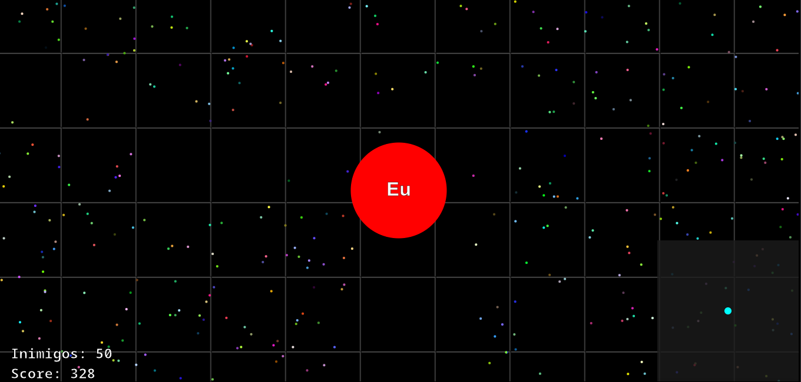

# agar.io-clone

> __Agar.io-clone__ é um clone do famoso jogo __agar.io__, feito em javascript, html e css.
### Porque desse projeto?

A escolha do projeto foi devdido a complexidade dos elementos que compõem o game e a necessidade de aprender a utilizar o canvas do html5.

### Desafio

O desafio consistiu em replicar o site __agar.io__, utilizando o canvas do html5, e typeScript / javascript que facilita a criação de jogos e aplicações interativas.
### O que ainda falta melhorar

- deixar o multiplayer
- ajustar elementos do jogo

### Tecnologias

- HTML
- CSS3
- TypeScript
- canvas

## Links
- demo: https://erisnilton.dev/agar.io-clone/
